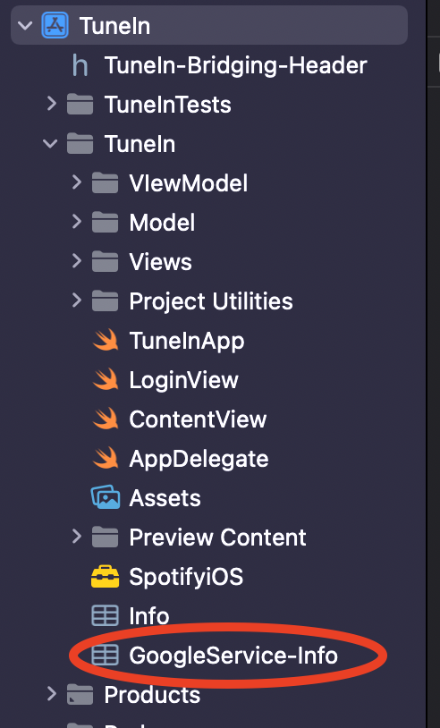
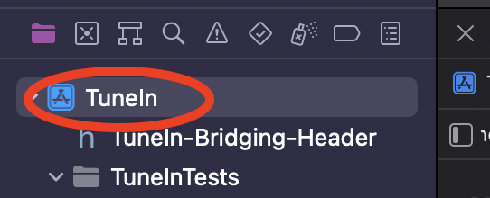
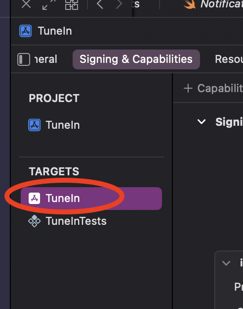
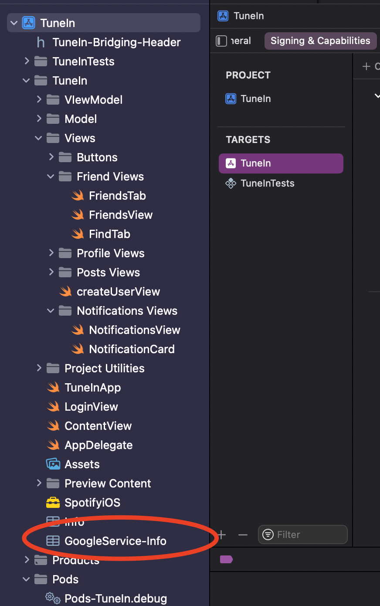

# TuneIn
Our app provides a platform for music listeners to post music in order to discover and share songs amongst their friends. Similar to that of an existing app, BeReal, users are expected to post a song of the day and users can interact with each other’s posts by liking, commenting, sharing a song, and listening to the song if they have a Spotify premium account. When posting, the users can add comments and moods to the post.

In addition, users can log in with their Spotify account and create and edit their own TuneIn profile, see their notifications, and remove friends. 

# Testing
Spartan is inaccessible when testing so the functions using Spartan were not tested. On the other hand, the rest of our view models have been tested.

# Requirements to run the application
1. Need an **IOS personal device** (you cannot run it on the simulator due to the Spotify API)
2. A **cable** to connect your personal device to the computer that is running the application
3. **Download “Spotify”** from the App Store and ensure you have an account
4. Ensure your **spotify account email** is saved as a developer in Spotify Developers 
* Kenny, Prof H, and a dummy account have been saved at your convenience
5. Obtain our **Google Info.plist** and add it to the folder that contains the Info.plist
6. *Optional* obtain **Spotify Premium** to experience the preview song feature
7. Ensure your personal device is in **development mode** and accepts TuneIn as a Developer App (running the app will instruct you on how to do this)

# Running the Application
1. Once you have met the stated requirements, open the application using “TuneIn.xcworkspace” file RATHER THAN “TuneIn.xcodeproj” file.
2. run “pod install” in your cmd line within the directory **/67443-app-main/TuneIn**
3. Run the application by hitting the play button or CMD “R” 
4. You will knowingly encounter two issues– visit “Bundle Identifier Error” in the “Possible Errors” section to resolve those issues
    - To fix the error for the bundle Identifier, choose a team your mac has and then use TuneIn-<initials> for the bundle identifier
      - For example, TuneIn-la
    - If you receive the error message, "TuneIn" requires a provisioning profile. Select a provisioning profile in the Signing & Capabilities editor, you can run the program with no used 
5. The application should build successfully on your computer and it will download on your personal device 
6. Refer to the Possible Errors section if you run into any difficulties

# Possible Errors 
## ”*/67443-app/TuneIn/Pods/Target Support Files/Alamofire/Alamofire-Info.plist'
If you get something similar to: ”*/67443-app/TuneIn/Pods/Target Support Files/Alamofire/Alamofire-Info.plist'. Did you forget to declare this file as an output of a script phase or custom build rule which produces it?

Clean the build folder in the Product tab
Go to the TuneIn folder and run “pod install” 

## Google.plist Missing
There is a good chance when you pull and try to run you will get an error message saying that the GoogleService-Info.plist cannot be found. The message would be along the lines of “Build input file cannot be found ‘*/GoogleService-Info.plist’. Did you forget to declare this file as an output of a script phase or custom build rule which produces it?

This message is because there is a file not included in the repo. This file has been sent to both Prof H and Kenny on Slack. The file should be included here:

## Bundle Identifier error
Often when pulling, you will get an error with the Bundle Identifier saying that it is not unique. To fix this: 

1) click on “TuneIn” circled in the image below:

2) Under targets, click on “TuneIn” which should be under the “Signing & Capabilities” tab

3) attempt to mimic the screenshot below. Your “Team” should be your Personal Team.
4) “Bundle Identifier” should contain a unique name. With some experimenting, “TuneIn-sm” worked personally for me but it must be unique per developer  

5) In the grey box below, there should be a “Try again” button if it did not “try again” on its own that you should click and it should work after clicking that button. 

6) Re-run the app
